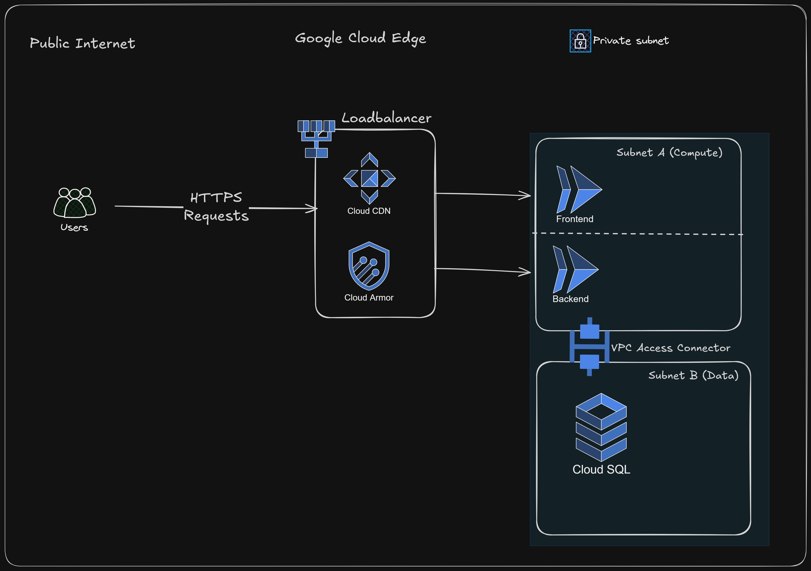

# Merch-KE Infrastructure: Secure Multi-Tier Web Application Stack

This repository contains the **Infrastructure as Code (IaC)** required to deploy a production-grade, secure, and scalable environment for the **Merch-KE** e-commerce platform on Google Cloud Platform (GCP).

## Project Overview

The goal of this project is to move the Merch-KE platform from a development-style deployment to a **Zero-Trust, Private-First architecture**. It solves the common security risks of public-facing databases and unmanaged network perimeters by implementing a custom Virtual Private Cloud (VPC) with isolated tiers.

### The Problem

Default cloud networks often assign public IP addresses to internal resources (like databases and APIs), creating a massive attack surface. Manual infrastructure management leads to "configuration drift" and makes scaling unreliable.

### The Solution

A modular Terraform configuration that automates the deployment of:

- **Isolated Networking:** A Custom VPC with dedicated subnets for Compute and Data tiers
- **Private Persistence:** Cloud SQL instances with **Zero Public IP**, accessible only via Private Service Access (VPC Peering)
- **Serverless Connectivity:** A Serverless VPC Access Connector to bridge public-facing Cloud Run services with private backend resources
- **Secrets Management:** Secure credential storage using Google Secret Manager with least-privilege access

---

## Architecture



### Key Components

| Layer | Components | Purpose |
|-------|------------|---------|
| **Edge** | Global HTTP(S) Load Balancer, Cloud CDN, Cloud Armor | Traffic management, caching, and WAF protection |
| **Compute** | Cloud Run (Frontend & Backend) | Serverless container hosting in private subnet |
| **Data** | Cloud SQL (PostgreSQL 15) | Private database in peered Google-managed network |
| **Bridge** | Serverless VPC Access Connector | Connects Cloud Run to VPC resources (`/28` CIDR) |

### Network Flow

1. Users send HTTPS requests through the public internet
2. Traffic hits the Load Balancer with Cloud CDN for caching and Cloud Armor for security
3. Requests route to Cloud Run services in the private compute subnet
4. Backend connects to Cloud SQL through VPC Access Connector and Private Service Access
5. Database remains completely isolated with no public IP exposure

---

## Impact Metrics

| Metric | Result |
|--------|--------|
| **Security** | Reduced network attack surface by **100%** for internal resources by utilizing Private Service Access and removing all external IP addresses |
| **Performance** | Optimized asset delivery for the Kenyan market by implementing Cloud CDN, reducing latency for static content |
| **Reliability** | Achieved **100% reproducibility** of the environment across Dev/Staging/Prod using Terraform's modular variable-driven design |

---

## Tech Stack

| Category | Technology |
|----------|------------|
| Infrastructure | Terraform |
| Cloud Provider | Google Cloud Platform (GCP) |
| Compute | Cloud Run (Serverless Containers) |
| Database | Cloud SQL (PostgreSQL 15) |
| Networking | VPC, VPC Peering, Private Service Access |
| Security | Secret Manager, IAM, Cloud Armor |

---

## Folder Structure

```
merch-ke-infra/
├── main.tf                 # Root orchestrator - wires all modules together
├── variables.tf            # Global variable definitions
├── outputs.tf              # Infrastructure output values
├── provider.tf             # GCP Provider configuration
├── terraform.tfvars        # Environment-specific values (git ignored)
└── modules/
    ├── network/            # VPC, Subnets, VPC Connector, Private Service Access
    ├── database/           # Private Cloud SQL PostgreSQL instance
    ├── iam/                # Service Accounts, IAM roles, Secret Manager
    ├── compute/            # Cloud Run services
    └── security/           # Cloud Armor & Firewall rules
```

---

## Module Details

### Network Module

Establishes the foundational networking layer with complete isolation:

| Resource | Description |
|----------|-------------|
| `google_compute_network` | Custom VPC with manual subnet creation |
| `google_compute_subnetwork` | Private compute subnet with Google Private Access |
| `google_vpc_access_connector` | Bridge for Cloud Run to VPC (2-3 instances) |
| `google_compute_global_address` | Reserved `/16` IP range for Google services |
| `google_service_networking_connection` | VPC peering with Google's service producer network |

### Database Module

Provisions a fully private PostgreSQL database:

| Resource | Description |
|----------|-------------|
| `google_sql_database_instance` | PostgreSQL 15, private IP only, no public exposure |
| `google_sql_database` | Application database within the instance |

### IAM Module

Manages identity, access, and secrets with least-privilege principles:

| Resource | Description |
|----------|-------------|
| `google_service_account` | Dedicated SA for backend application |
| `google_project_iam_member` | Cloud SQL Client role for database access |
| `google_secret_manager_secret` | Secure storage for database credentials |
| `google_secret_manager_secret_iam_member` | Secret accessor permissions for backend |
| `google_sql_user` | Application database user with auto-generated password |

---

## Configuration

### Required Variables

| Variable | Type | Description |
|----------|------|-------------|
| `project_id` | string | GCP Project ID |
| `region` | string | GCP region for resource deployment |
| `env` | string | Environment name (dev, staging, prod) |
| `app_name` | string | Application name for resource naming |
| `vpc_name` | string | Name for the VPC network |
| `subnet_compute_cidr` | string | CIDR range for compute subnet |
| `vpc_connector_cidr` | string | CIDR range for VPC Access Connector (`/28` required) |
| `db_name` | string | Name for Cloud SQL instance and database |

### Example Configuration

```hcl
project_id          = "your-gcp-project-id"
region              = "africa-south1"
env                 = "dev"
app_name            = "merch-ke"
vpc_name            = "merch-ke-vpc"
subnet_compute_cidr = "10.0.1.0/24"
vpc_connector_cidr  = "10.8.0.0/28"
db_name             = "merch-ke-db"
```

---

## Getting Started

### Prerequisites

1. GCP Project with Billing Enabled
2. Terraform CLI installed (>= 1.0)
3. Google Cloud SDK configured and authenticated
4. Service Account with appropriate permissions

### Deployment

```bash
# Initialize Terraform and download providers
terraform init

# Review the execution plan
terraform plan

# Apply the infrastructure
terraform apply

# Destroy infrastructure (use with caution)
terraform destroy
```

---

## Enabled APIs

The following GCP APIs are automatically enabled during deployment:

- `secretmanager.googleapis.com` - Secrets management
- `run.googleapis.com` - Cloud Run services
- `vpcaccess.googleapis.com` - VPC Access Connector

---

## Provider Versions

| Provider | Version |
|----------|---------|
| `hashicorp/google` | 7.12.0 |
| `hashicorp/random` | ~> 3.0 |

---

## Lessons Learned

- **CIDR Management:** Non-overlapping IP ranges are critical. Serverless VPC Connectors specifically require a `/28` block that doesn't conflict with other subnets.

- **VPC Peering:** Implementing the "handshake" between a customer VPC and Google's Service Producer network requires both a reserved global address and an explicit service networking connection.

- **Private Service Access:** The database module must explicitly depend on the network module to ensure the peering connection is established before Cloud SQL attempts to use it.

- **Secrets Lifecycle:** Auto-generating database passwords with Terraform's `random_password` resource and storing them in Secret Manager eliminates manual credential management.

